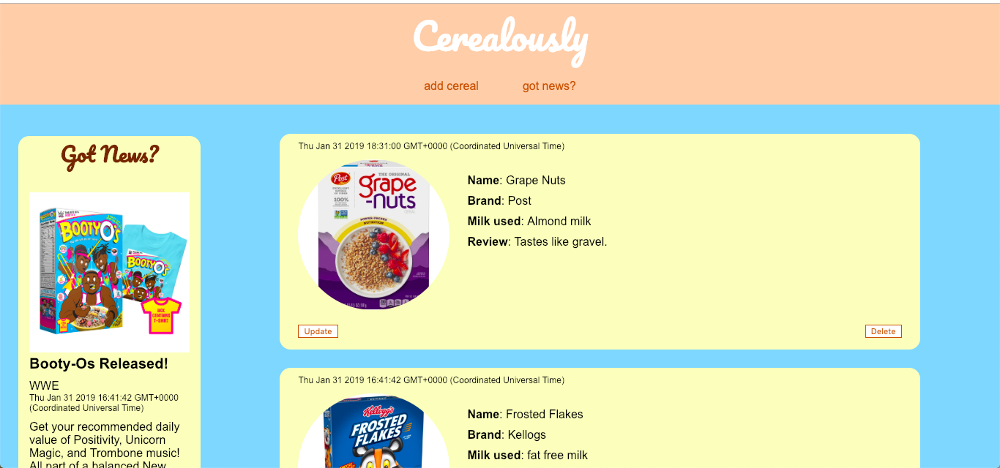

# Cerealously

## What Is This?
An app to review cereal brands & for breaking news of a balanced breakfast.

__Requirements:__

:ballot_box_with_check: Be built using Express, Handlebars and Mongoose.

:ballot_box_with_check: Have at least 2 non-User models.

:ballot_box_with_check: Have complete CRUD functionality implemented with RESTful routes.

:ballot_box_with_check: Be deployed to Heroku.

:ballot_box_with_check: Have validated, semantically-clean HTML and CSS and a polished appearance.

:ballot_box_with_check: Demonstrate a good commit history.

__Bonuses:__

:x: Nest one of your resources inside another one using subdocuments.

:x: Relate two resources to each other using refs.

:x: Use information from a 3rd party API and integrate it with your mongoose models.

:x: Let users sign in with a third-party account (Facebook, Twitter, GitHub, etc.).

:x: Paginate your list views.

:x: Allow users to upload images to your application, and persist these images.

__Extras:__

:ballot_box_with_check: Mobile responsive.

## Conception & Planning

One piece of advice for planning our projects was to make another version of an existing website. On of my favorite websites/apps is <a href="https://www.goodreads.com/">Goodreads</a>, a social media for books: what you're currently reading and your progress, what you have read and your ratings/reviews, and what you want to read. That's the basic gist of it anyway.

## Technology Used
:arrow_right: Express

:arrow_right: Handlebars

:arrow_right: HTML & CSS

:arrow_right: Javascript

:arrow_right: JSON

:arrow_right: MongoDB & Mongoose

## Installation Instructions
__Dependencies Used:__

:arrow_right: body-parser

:arrow_right: express

:arrow_right: hbs

:arrow_right: method-override

:arrow_right: mongoose

## Use The App
https://cerealously.herokuapp.com/

## Unsolved Problems
Without user authentication it is even easier to spam/break this app. User authentication would definitely be a step in the right direction. However, ideally if I could connect it to an API where people could select their cereal of choice and just input their review (and rating) of the products. This would also solve the issue of finding pictures that will fit well into the layout rather than entrusting the users to pick one.

## For The Future
:o: Add user authentication.

:o: Create a real logo for the app.

:o: Adjust layout colors.

:o: Convert CSS to SASS.

:o: Add star rating stystem for cereals.

__Reach Goals__

:o: Find & connect to a cereal/grocery API so that people could just search for and pick out the cereals so they don't have to hunt down the information/facts. Then I could theoretically include health information as well.

## Credits
Thank you to Stuart Fooks, Rendon Elsessor, Roger Campbell II, Lindsay Urchyk, and Fathia Mohammed for their help in the creation and deployment of this app.